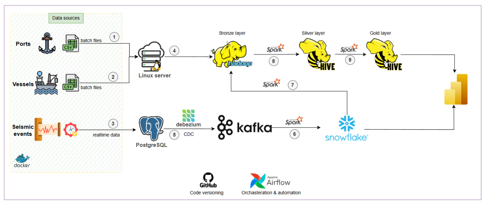

# TidaLine Data Platform (ITI DM45)

Real-time and batch data pipeline for ports, vessels, and seismic activity — built using Python, Airflow, Docker, Kafka, and Spark.

---

## Overview

TidaLine is a logistics and energy infrastructure company focused on maritime activities and seismic risk monitoring. This data platform integrates:

- Monthly World Port Index (WPI) data
- Daily scraped vessel data (from VesselFinder)
- Real-time seismic events (from EMSC)
- Batch and streaming pipelines
- Power BI dashboards for insights

---

## Architecture




### Key Components:
- Python ETL Scripts (Ports, Vessels, Seismic)
- PostgreSQL (Operational DB)
- Debezium + Kafka (CDC streaming)
- Apache Airflow (Orchestration)
- Apache Spark (Processing)
- Apache Hive (SQL access over HDFS data)
- Snowflake (ODS & BI)
- SFTP & HDFS (Data Lake Staging)

---

## Getting Started

### 1. Clone the repo

```bash
git clone https://github.com/Ahmed-Naserelden/Logistics-Risk-Intelligence.git
cd Logistics-Risk-Intelligence
```

### 2. Run services with Docker Compose

```bash
docker-compose up -d
```

### 3. Airflow Web UI

Visit: [http://localhost:8080](http://localhost:8080)

---

## Scheduling

- Ports CSV: Monthly
- Vessel Scraper: Daily
- Seismic Stream: Real-time (long-running service)

---

## Git Strategy

We follow **GitHub Flow**. All features must be developed in branches and merged via Pull Requests.

## Testing

```bash
pytest
```

GitHub Actions will automatically test each PR.

---

## Technologies

- Python, Pandas, BeautifulSoup, Requests
- PostgreSQL, Debezium, Kafka, Airflow
- Spark, HDFS, Hive, Docker, GitHub Actions
- Power BI / Tableau